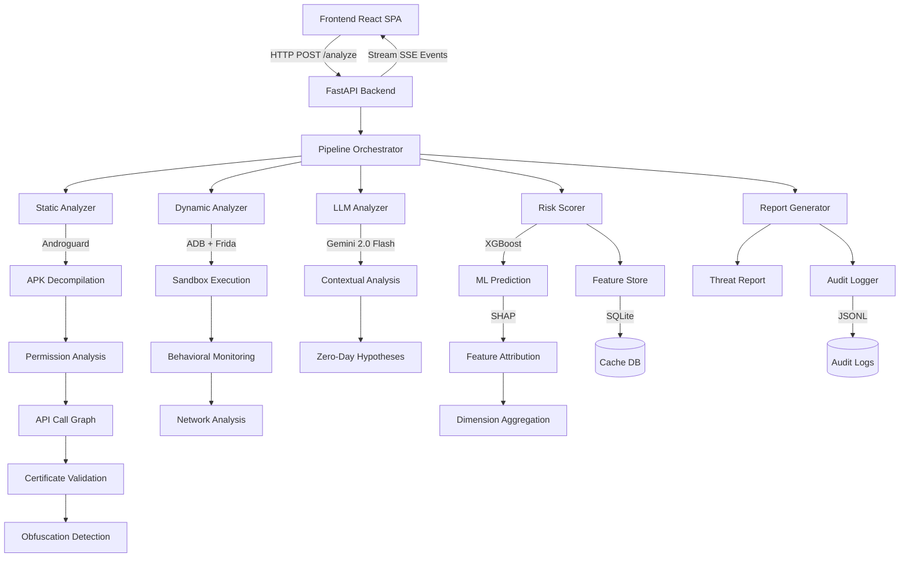

<div align="center">

# 🛡️ MobileGuard AI

### Advanced AI-Powered Mobile Threat Intelligence Platform

[](https://fastapi.tiangolo.com/)
[](https://react.dev/)
[](https://xgboost.readthedocs.io/)
[](https://www.python.org/)
[](LICENSE)

**A multi-stage AI security assessment platform for Android applications combining static analysis, dynamic sandboxing, LLM-powered behavioral analysis, and explainable machine learning.**

[Features](#-features) • [Architecture](#-architecture) • [Installation](#-installation) • [Usage](#-usage) • [API Reference](#-api-reference) • [Development](#-development)

</div>

---

## 📋 Table of Contents

- [Overview](#-overview)
- [Features](#-features)
- [Architecture](#-architecture)
- [Technology Stack](#-technology-stack)
- [Installation](#-installation)
- [Configuration](#-configuration)
- [Usage](#-usage)
- [API Reference](#-api-reference)
- [Pipeline Components](#-pipeline-components)
- [Machine Learning](#-machine-learning)
- [Frontend Architecture](#-frontend-architecture)
- [Testing](#-testing)
- [Deployment](#-deployment)
- [Project Structure](#-project-structure)
- [Contributing](#-contributing)
- [License](#-license)

---

## 🔍 Overview

MobileGuard AI is an enterprise-grade Android malware detection system designed for financial institutions, security operations centers (SOCs), and cybersecurity agencies. It provides comprehensive threat analysis through a five-stage pipeline:

1. **Static Analysis** - APK decompilation, permission analysis, API usage patterns, certificate validation, code obfuscation detection
2. **Dynamic Analysis** - Sandbox execution with network traffic monitoring, behavioral anomaly detection, and runtime API hooking
3. **LLM Analysis** - Gemini 2.0 Flash-powered contextual threat assessment with India-specific banking trojan detection
4. **Risk Scoring** - XGBoost-based ML classifier with SHAP explainability and multi-dimensional risk aggregation
5. **Report Generation** - Actionable intelligence reports with forensic indicators and executive summaries

**Key Differentiators:**
- **Explainable AI** - SHAP values show which features drove the risk score
- **Regional Threat Intelligence** - India-specific banking malware patterns (UPI, OTP interception)
- **Real-time Streaming** - Server-sent events provide live analysis progress
- **Multi-modal Analysis** - Combines rule-based, ML, and LLM approaches
- **Audit Trail** - JSONL-based audit logging with SQLite feature caching

---

## ✨ Features

### 🔬 **Static Analysis Engine**
- **APK Parsing** - Androguard-based decompilation with manifest extraction
- **Permission Profiling** - 22+ dangerous permission detection with combo risk scoring
- **API Fingerprinting** - Call graph analysis with 14+ suspicious API pattern matching
- **Obfuscation Detection** - Shannon entropy analysis on strings, base64 pattern matching
- **Certificate Validation** - Self-signed cert detection, validity period analysis, issuer verification
- **Native Code Inspection** - `.so` library enumeration with known malware signature matching
- **Call Graph Construction** - NetworkX-based control flow analysis with graph density metrics

### 🏗️ **Dynamic Analysis Sandbox**
- **Execution Modes** - Live sandbox (ADB + Frida + mitmproxy) or emulated mode
- **Behavioral Monitoring** - SMS send attempts, accessibility service abuse, silent install detection
- **Network Traffic Analysis** - Domain extraction, C2 server detection, data exfiltration measurement
- **Runtime API Hooking** - Frida-based instrumentation for camera/microphone/location access
- **Device Admin Detection** - Privilege escalation attempt monitoring
- **Malware Family Matching** - Similarity scoring against known banking trojans

### 🤖 **LLM-Powered Intelligence**
- **Model** - Google Gemini 2.0 Flash with custom security analyst system prompt
- **Contextual Analysis** - Decompiled code interpretation with malicious behavior extraction
- **Evidence-Based Reasoning** - Cites specific class names, methods, and API calls
- **Zero-Day Hypothesis Generation** - Novel threat detection for unknown malware families
- **India-Specific Risk Assessment** - UPI, BHIM, PhonePe, Paytm targeting detection
- **Structured JSON Output** - Confidence scores, verdict classification, executive summaries

### 📊 **Machine Learning & Explainability**
- **XGBoost Classifier** - 300 tree ensemble with early stopping and class imbalance handling
- **37 Engineered Features** - Permission risk, obfuscation metrics, graph topology, certificate trust
- **SHAP Explainability** - TreeExplainer integration with top-5 feature attribution
- **Synthetic Training Data** - Drebin/CIC-AndMal-compatible feature distributions
- **Multi-Dimensional Scoring** - 6 weighted risk dimensions (permissions, obfuscation, behavior, ML, trust, LLM)
- **Boost Rules** - Context-aware risk amplification (SMS + C2 + Accessibility)

### 📝 **Reporting & Compliance**
- **Threat Reports** - Structured JSON with verdict, forensic indicators, recommended actions
- **Audit Logging** - ISO 8601 timestamped JSONL logs with dimension scores and SHAP values
- **Feature Store** - SQLite-based result caching for duplicate APK detection
- **CERT-In Compliance** - Reporting format aligned with Indian cybersecurity standards

### 🎨 **Modern React Frontend**
- **Real-time Updates** - Server-sent events with live progress tracking
- **Interactive Visualizations** - Recharts-based risk gauge, dimension radar charts, SHAP waterfall plots
- **Framer Motion Animations** - Smooth page transitions and component mounting
- **Tailwind CSS Design System** - Dark mode with glassmorphism effects
- **Responsive Layout** - Mobile-first design with 12-column grid
- **Lucide Icons** - Shield, Activity, AlertTriangle, and 50+ security icons

---

## 🏛️ Architecture



### **Data Flow**

1. **User uploads APK** → Frontend sends multipart/form-data POST
2. **Backend validates** → Size check (150MB max), magic byte verification (PK header)
3. **Orchestrator streams events** → Each stage emits SSE with progress percentage
4. **Static analysis** → 14 numeric features + graph topology metrics
5. **Dynamic analysis** → Sandbox execution (if enabled) or emulated mode
6. **LLM analysis** → Gemini API call with decompiled code context
7. **Risk scorer builds feature vector** → 37-dimensional array for XGBoost
8. **SHAP explainer** → Top-5 feature contributions extracted
9. **Report generated** → JSON with verdict (APPROVE/MONITOR/ESCALATE/BLOCK)
10. **Results cached** → SQLite feature store + JSONL audit log
11. **Frontend renders** → Risk gauge, dimension chart, SHAP waterfall, threat report

---

## 🔧 Technology Stack

### **Backend**
| Component | Technology | Version | Purpose |
|-----------|-----------|---------|---------|
| **API Framework** | FastAPI | 0.111.0 | Async REST API with OpenAPI docs |
| **ASGI Server** | Uvicorn | 0.30.1 | Production ASGI server with WebSocket support |
| **APK Analysis** | Androguard | 3.3.5 | DEX decompilation, manifest parsing |
| **ML Framework** | XGBoost | 2.0.3 | Gradient boosting classifier |
| **Explainability** | SHAP | 0.45.1 | TreeExplainer for feature attribution |
| **LLM API** | Google Gemini | 2.0 Flash | Contextual code analysis |
| **Graph Analysis** | NetworkX | 3.3 | Call graph construction |
| **Data Processing** | Pandas + NumPy | 2.2.2 + 1.26.4 | Feature engineering |
| **Database** | SQLAlchemy | 2.0.30 | ORM for SQLite feature store |
| **File Type Detection** | python-magic | 0.4.27 | APK validation |
| **Testing** | pytest + httpx | 8.2.2 + 0.27.0 | Unit/integration tests |

### **Frontend**
| Component | Technology | Version | Purpose |
|-----------|-----------|---------|---------|
| **Framework** | React | 19.2.6 | Component-based UI |
| **Build Tool** | Vite | 8.0.12 | Fast HMR development server |
| **Styling** | Tailwind CSS | 3.4.19 | Utility-first CSS framework |
| **Charts** | Recharts | 3.8.1 | D3-based data visualization |
| **Animations** | Framer Motion | 12.40.0 | Declarative animations |
| **Icons** | Lucide React | 1.20.0 | SVG icon library |
| **HTTP Client** | Fetch API | Native | Server-sent events streaming |

### **Infrastructure**
- **Containerization** - Docker + Docker Compose
- **Reverse Proxy** - Nginx (frontend static serving)
- **Storage** - SQLite (feature cache), JSONL (audit logs)

---

## 📦 Installation

### **Prerequisites**

```bash
# Python 3.11+
python --version  # Should be >= 3.11

# Node.js 20+
node --version    # Should be >= 20

# Docker & Docker Compose (optional)
docker --version
docker-compose --version

# Java Runtime (for Androguard)
java -version     # Required for APK decompilation

# ADB (for live sandbox mode)
adb version       # Optional - only if USE_LIVE_SANDBOX=true
```

### **Quick Start (Docker)**

```bash
# 1. Clone the repository
git clone https://github.com/yourusername/mobileguard-ai.git
cd mobileguard-ai

# 2. Configure environment variables
cp .env.example .env
nano .env  # Add your GEMINI_API_KEY

# 3. Build and run with Docker Compose
docker-compose up --build

# 4. Access the application
# Frontend: http://localhost:3000
# Backend API: http://localhost:8000
# API Docs: http://localhost:8000/docs
```

### **Development Setup (Local)**

#### **Backend**
```bash
cd backend

# Create virtual environment
python -m venv venv
source venv/bin/activate  # Windows: venv\Scripts\activate

# Install dependencies
pip install -r requirements.txt

# Train the XGBoost model (generates models/xgboost_mobileguard.json)
python -m backend.training.train_xgboost

# Start the API server
uvicorn backend.main:app --reload --host 0.0.0.0 --port 8000
```

#### **Frontend**
```bash
cd frontend

# Install dependencies
npm install

# Start development server with HMR
npm run dev

# Build for production
npm run build
npm run preview  # Preview production build
```

---

## ⚙️ Configuration

### **Environment Variables (.env)**

```bash
# Required
GEMINI_API_KEY="your-gemini-api-key-here"

# Optional
VIRUSTOTAL_API_KEY="your-vt-api-key"          # For threat intelligence enrichment
USE_LIVE_SANDBOX="false"                      # Enable ADB-based sandbox (requires devices)
MAX_APK_SIZE_MB="150"                         # Max upload size
SANDBOX_TIMEOUT_SECS="90"                     # Dynamic analysis timeout

# Paths (auto-configured)
FEATURE_CACHE_DB="data/feature_cache.sqlite"
AUDIT_LOG_PATH="data/audit.jsonl"
MODEL_PATH="models/xgboost_mobileguard.json"
```

### **Configuration Files**

**Backend Configuration** (`backend/config.py`):
- `LLM_MODEL` - Gemini model name (default: `gemini-2.0-flash`)
- `RISK_THRESHOLDS` - Score boundaries for APPROVE/MONITOR/ESCALATE/BLOCK
- `DANGEROUS_PERMISSIONS` - Permission risk weights (0-5 scale)
- `SUSPICIOUS_API_PATTERNS` - Regex patterns for malicious API detection

**Frontend Configuration** (`frontend/vite.config.js`):
- Build settings for production optimization
- Proxy configuration for local development

**Tailwind Config** (`frontend/tailwind.config.js`):
- Custom color palette (background, accent, danger, success)
- Animation keyframes for glow effects

---

## 🚀 Usage

### **Web Interface**

1. **Navigate** to `http://localhost:3000`
2. **Check System Status** - Verify API health and model loading
3. **Upload APK** - Drag & drop or click to select `.apk` file (max 150MB)
4. **Monitor Progress** - Watch real-time analysis stages:
   - Static Analysis (0-30%)
   - Dynamic Analysis (30-50%)
   - LLM Analysis (50-70%)
   - Risk Scoring (70-90%)
   - Report Generation (90-100%)
5. **Review Results**:
   - **Risk Gauge** - Composite score with action recommendation
   - **Dimension Chart** - 6 risk dimension breakdown
   - **SHAP Explainer** - Top-5 features driving the score
   - **Threat Report** - Executive summary with forensic indicators
6. **Audit Log** - View historical analyses with scores and timestamps

### **API Usage**

#### **Analyze APK**
```bash
curl -X POST "http://localhost:8000/analyze" \
  -H "Content-Type: multipart/form-data" \
  -F "file=@sample.apk" \
  --no-buffer  # Required for SSE streaming
```

**Response** (Server-Sent Events):
```
data: {"stage":"static_analysis","status":"running","progress":10}

data: {"stage":"dynamic_analysis","status":"running","progress":40}

data: {"stage":"llm_analysis","status":"running","progress":60}

data: {"stage":"risk_scoring","status":"running","progress":80}

data: {"stage":"report_generation","status":"running","progress":90}

data: {"stage":"complete","status":"done","progress":100,"result":{...}}
```

#### **Health Check**
```bash
curl http://localhost:8000/health
```

**Response:**
```json
{
  "status": "ok",
  "version": "1.0.0",
  "model_loaded": true,
  "sandbox_available": false
}
```

#### **Retrieve Cached Analysis**
```bash
curl http://localhost:8000/analysis/{apk_sha256_hash}
```

#### **Fetch Audit Log**
```bash
curl "http://localhost:8000/audit-log?limit=10&offset=0"
```

---

## 📚 API Reference

### **Endpoints**

#### `POST /analyze`
Analyze an APK file with full pipeline execution.

**Request:**
- **Body** - `multipart/form-data`
- **Field** - `file` (APK binary, max 150MB)

**Response:**
- **Content-Type** - `text/event-stream`
- **Events** - JSON objects with `stage`, `status`, `progress`, `error`, `result` fields

**Error Codes:**
- `422` - Invalid APK format (not a ZIP/PK header)
- `413` - File too large (> 150MB)
- `500` - Analysis pipeline failure

#### `GET /health`
System health and component availability.

**Response:**
```json
{
  "status": "ok",
  "version": "1.0.0",
  "model_loaded": true,
  "sandbox_available": false
}
```

#### `GET /analysis/{apk_hash}`
Retrieve cached analysis by SHA256 hash.

**Response:** Full `AnalysisResult` JSON

**Error Codes:**
- `404` - Hash not found in cache
- `503` - Feature store unavailable

#### `GET /audit-log`
Fetch audit log entries.

**Query Parameters:**
- `limit` (int) - Max entries (default: 50)
- `offset` (int) - Pagination offset (default: 0)

**Response:**
```json
{
  "entries": [
    {
      "apk_hash": "abc123...",
      "filename": "sample.apk",
      "score": 68.5,
      "action": "ESCALATE",
      "analyzed_at": "2026-06-18T10:30:45Z"
    }
  ]
}
```

#### `DELETE /cache/{apk_hash}`
Remove cached analysis result.

**Response:** `{"status": "ok"}`

---

## 🔬 Pipeline Components

### **1. Static Analyzer**

**File:** `backend/pipeline/static_analyzer.py`

**Features Extracted:**
```python
@dataclass
class StaticFeatures:
    apk_hash: str                      # SHA256 hash
    package_name: str                  # com.example.app
    permission_list: List[str]         # Manifest permissions
    permission_danger_score: float     # 0-100 weighted risk
    dangerous_permission_count: int    # Count of high-risk perms
    suspicious_api_count: int          # Matches against SUSPICIOUS_API_PATTERNS
    api_suspicion_score: float         # 0-100 API risk
    top_apis: List[str]                # Most called methods
    high_entropy_count: int            # Shannon > 4.5
    obfuscation_score: float           # 0-100 code obfuscation
    suspicious_urls: List[str]         # Extracted HTTP(S) URLs
    c2_hit_count: int                  # C2 IP matches
    is_self_signed: bool               # Certificate issuer = subject
    cert_trust_score: float            # 0-100 certificate trust
    has_native_code: bool              # .so libraries present
    native_risk_score: float           # 0-100 native lib risk
    receiver_list: List[str]           # Broadcast receivers
    service_list: List[str]            # Background services
    graph_density: float               # NetworkX call graph density
    graph_node_count: int              # Methods in call graph
    graph_edge_count: int              # Method calls
    min_sdk: int                       # Minimum Android SDK
    target_sdk: int                    # Target Android SDK
```

**Risk Calculation:**
- **Permission Combo Bonus** - READ_SMS + INTERNET = +10 points
- **Self-Signed Penalty** - -40 cert_trust_score
- **Native Library Check** - Matches KNOWN_MALICIOUS_LIBS (libfrida-gadget.so, etc.)

### **2. Dynamic Analyzer**

**File:** `backend/pipeline/dynamic_analyzer.py`

**Sandbox Modes:**
- **Live Mode** (`USE_LIVE_SANDBOX=true`) - Requires ADB + Frida + mitmproxy
  - Installs APK on connected device
  - Injects Frida hooks for API monitoring
  - Captures network traffic with mitmproxy
  - Runs `monkey` for UI interaction
- **Emulated Mode** (default) - Returns neutral values when no sandbox available

**Features Extracted:**
```python
@dataclass
class DynamicFeatures:
    sandbox_mode: str                  # "live" or "emulated"
    sms_send_attempts: int             # sendTextMessage() calls
    network_domains_contacted: List[str]
    c2_domains_hit: int                # Known C2 matches
    data_exfil_bytes: int              # Total outbound traffic
    accessibility_service_abused: bool # Overlay attack detection
    clipboard_hijack_detected: bool    # ClipboardManager hooks
    silent_install_attempted: bool     # PackageInstaller calls
    camera_accessed: bool              # Camera.open() detected
    microphone_accessed: bool          # MediaRecorder usage
    location_accessed: bool            # GPS provider access
    device_admin_requested: bool       # DevicePolicyManager
    behavioural_anomaly_score: float   # 0-100 runtime risk
    matched_malware_family: str        # e.g. "BankBot", "Unknown"
    family_similarity_score: float     # 0.0-1.0 confidence
```

**Live Sandbox Requirements:**
```bash
# Android Debug Bridge
adb devices  # Must show at least one device

# Frida (optional - for runtime hooking)
pip install frida-tools
frida-ps -U  # List processes on USB device

# mitmproxy (optional - for network capture)
pip install mitmproxy
mitmdump --version
```

### **3. LLM Analyzer**

**File:** `backend/pipeline/llm_analyzer.py`

**System Prompt:**
> You are an elite Android malware analyst at a national cybersecurity agency. You have 15 years of experience with banking trojans, spyware, SMS stealers, and overlay attack frameworks. Never speculate without evidence from the code. Never produce generic statements — cite specific class names, method names, API calls, or string literals from the code.

**Features Extracted:**
```python
@dataclass
class LLMFeatures:
    primary_function: str              # "What this app really does"
    malicious_behaviors: List[str]     # Specific behaviors with evidence
    data_collection: List[str]         # Data exfiltration methods
    obfuscation_techniques: List[str]  # Code obfuscation patterns
    attack_vectors: List[str]          # Technical attack chains
    india_specific_risks: List[str]    # UPI/OTP/Banking risks
    severity_score: float              # 0.0-1.0 LLM confidence
    confidence: float                  # 0.0-1.0 verdict confidence
    verdict: str                       # CRITICAL/HIGH/MEDIUM/LOW/UNKNOWN
    recommended_action: str            # Next steps for analyst
    executive_summary: str             # 2-3 sentence summary
    zero_day_hypotheses: List[str]     # Novel threat theories
```

**Zero-Day Detection:**
- Triggered when `severity_score > 0.6` AND `family_similarity_score < 0.4`
- Generates 3 ranked threat hypotheses for unknown malware

**API Configuration:**
```python
import google.generativeai as genai

genai.configure(api_key=GEMINI_API_KEY)
model = genai.GenerativeModel("gemini-2.0-flash")
response = model.generate_content(prompt)
```

### **4. Risk Scorer**

**File:** `backend/pipeline/risk_scorer.py`

**Multi-Dimensional Scoring:**
```python
dimension_scores = {
    "permission_abuse": 20% weight,      # Dangerous permissions
    "obfuscation": 15% weight,           # Code obfuscation
    "behavioral_anomaly": 25% weight,    # Runtime behavior
    "ml_malware": 20% weight,            # XGBoost prediction
    "developer_trust": 10% weight,       # Certificate validation
    "llm_severity": 10% weight,          # Gemini assessment
}

composite_score = Σ(dimension_score × weight)
```

**Boost Rules (Context-Aware Amplification):**
- SMS send attempts → +15 points
- C2 domains contacted → +20 points
- Accessibility service abuse → +12 points
- Static C2 IPs found → +10 points
- LLM verdict CRITICAL → +10 points
- Silent install attempt → +15 points

**Action Thresholds:**
```python
RISK_THRESHOLDS = {
    "LOW":    0-25  → APPROVE,
    "MEDIUM": 26-50 → MONITOR,
    "HIGH":   51-75 → ESCALATE,
    "CRITICAL": 76-100 → BLOCK
}
```

**SHAP Explainability:**
```python
explainer = shap.TreeExplainer(xgb_model)
shap_values = explainer.shap_values(feature_vector)

# Extract top 5 contributors
top_features = [
    ("permission_danger", +18.5),
    ("obfuscation_score", +12.3),
    ("c2_hit_count", +9.7),
    ("has_native_code", +5.2),
    ("graph_density", -3.1)
]
```

### **5. Report Generator**

**File:** `backend/pipeline/report_generator.py`

**Report Structure:**
```
VERDICT: BLOCK — App exhibits clear signs of malicious intent.
RISK SCORE: 82.3/100 — Score driven by: permission_danger (+18.5), c2_hit_count (+12.0)

TECHNICAL FINDINGS:
  - Permission Analysis: 8 dangerous permissions requested.
  - Code Behaviour: Banking overlay with SMS interception. Accessibility service abuse for OTP capture.
  - Network Activity: Contacted 3 domains. C2 hits: 1.
  - Obfuscation: 127 high entropy strings detected (Score: 64.2).

INDIA-SPECIFIC THREAT: UPI transaction overlay, OTP SMS interception targeting Bank of India users.

RECOMMENDED ACTIONS:
  1. Immediate: Block application execution and network access.
  2. Investigation: Identify affected devices and reset credentials.
  3. Reporting: File a formal report with CERT-In.

EVIDENCE SUMMARY:
  * Hardcoded C2 IPs detected in code
  * Requests Accessibility Service (Overlay/Keylogger potential)
  * LLM identified: SMS interception with runtime code injection
  * Network traffic to known C2 domains
  * Suspicious API usage: sendTextMessage, getDeviceId, Runtime.exec
```

**Forensic Indicators:**
Top 5 evidence items ranked by criticality, with technical citations (class names, method names, API calls).

---

## 🤖 Machine Learning

### **Model Training**

**Dataset Generation:**
```bash
python -m backend.training.train_xgboost
```

**Synthetic Data Distribution:**
- **Benign Apps** (n=800)
  - Permission danger: μ=15, σ=10
  - API suspicion: μ=16, σ=8
  - Obfuscation: μ=12, σ=8
  - Self-signed: 60%
- **Malicious Apps** (n=800)
  - Permission danger: μ=70, σ=18
  - API suspicion: μ=72, σ=18
  - Obfuscation: μ=65, σ=20
  - Self-signed: 90%

**Feature Engineering (`backend/training/feature_engineering.py`):**
- Missing value imputation (median strategy)
- Column removal (>40% missing)
- StandardScaler normalization
- SMOTE oversampling (if class imbalance > 5:1)

**Model Hyperparameters:**
```python
XGBClassifier(
    n_estimators=300,           # 300 boosting rounds
    max_depth=6,                # Tree depth
    learning_rate=0.05,         # Step size shrinkage
    subsample=0.8,              # Row sampling
    colsample_bytree=0.8,       # Column sampling
    scale_pos_weight=ratio,     # Class imbalance weight
    eval_metric=["logloss", "auc"],
    early_stopping_rounds=20,   # Validation patience
    tree_method="hist"          # CPU-optimized
)
```

**Evaluation Metrics (`backend/training/evaluate.py`):**
- Precision, Recall, F1-Score
- ROC-AUC
- Confusion Matrix
- Feature Importance (gain/weight/cover)

**Model Artifacts:**
```
models/
├── xgboost_mobileguard.json      # Trained XGBoost model
├── scaler.pkl                    # StandardScaler object
├── feature_columns.json          # 37 feature names
└── shap_feature_importance.png  # SHAP summary plot
```

### **Real-World Dataset Integration**

Replace synthetic data with:
- **Drebin Dataset** - 15,036 malware samples, 123K+ benign apps
- **CIC-AndMal2017** - 426 malware families across 5 categories
- **AndroZoo** - 10M+ APKs with VirusTotal labels

```python
# Example: Load Drebin parquet
df = pd.read_parquet("data/drebin_features.parquet")
X, y, feature_columns, scaler = engineer_features(df)
```

---

## 🎨 Frontend Architecture

### **Component Hierarchy**

```
App.jsx
├── Header (System Status)
│   ├── API Health Indicator
│   ├── Analysis Engine Status
│   └── Last Scan Timestamp
│
├── Left Panel (4 cols)
│   ├── UploadZone (Drag & Drop)
│   └── ProgressTracker (5 stages with icons)
│
└── Right Panel (8 cols)
    ├── ActionBanner (Verdict + Score)
    ├── RiskGauge (Circular gauge with gradient)
    ├── DimensionChart (Radar chart with 6 axes)
    ├── ShapExplainer (Waterfall plot)
    ├── ThreatReport (Collapsible sections)
    └── AuditLog (Paginated table)
```

### **Key Components**

**UploadZone** (`src/components/UploadZone.jsx`):
- Drag-and-drop zone with hover state
- File type validation (`.apk` only)
- Size validation (150MB max client-side check)
- Lucide Upload icon with animation

**ProgressTracker** (`src/components/ProgressTracker.jsx`):
- 5 stages with icons (FileSearch, Activity, Brain, BarChart, FileText)
- Progress bar with gradient fill
- Real-time status updates from SSE
- Error state with AlertTriangle icon

**RiskGauge** (`src/components/RiskGauge.jsx`):
- Recharts RadialBarChart
- Dynamic color gradient (green → yellow → orange → red)
- Score label with action badge
- Animated arc fill with easeElastic

**DimensionChart** (`src/components/DimensionChart.jsx`):
- Recharts RadarChart with 6 dimensions
- Permission Abuse, Obfuscation, Behavioral Anomaly, ML Malware, Developer Trust, LLM Severity
- Gradient fill with opacity
- Tooltip with dimension explanations

**ShapExplainer** (`src/components/ShapExplainer.jsx`):
- Top 5 feature contributions
- Positive values (red) vs Negative values (green)
- Horizontal bar chart with labels
- Explanation text from risk_scorer

**ThreatReport** (`src/components/ThreatReport.jsx`):
- Collapsible sections (Executive Summary, Technical Findings, Evidence)
- Copy-to-clipboard functionality
- Malware family badge
- India-specific risk flag
- Forensic indicators with checkboxes

**ActionBanner** (`src/components/ActionBanner.jsx`):
- Color-coded by action (APPROVE=green, MONITOR=yellow, ESCALATE=orange, BLOCK=red)
- Large composite score display
- Icon (Shield, AlertTriangle, XCircle)
- Framer Motion slide-in animation

### **Design System**

**Colors** (Tailwind config):
```javascript
colors: {
  background: "#07111F",     // Deep navy
  card: "rgba(255,255,255,0.04)", // Glassmorphism
  accent: "#3B82F6",         // Blue
  success: "#22C55E",        // Green
  warning: "#F59E0B",        // Amber
  danger: "#EF4444",         // Red
  muted: "#64748B",          // Slate
  textPrimary: "#F8FAFC",    // Off-white
  textSecondary: "#94A3B8"   // Light slate
}
```

**Animations**:
- Page load: Staggered fade-in (Framer Motion)
- Card mount: Scale + opacity transition
- Progress bar: Smooth width animation with spring physics
- Gauge fill: Arc sweep with easeElastic timing

**Typography**:
- Font: Inter (variable font for optimal performance)
- Heading: 4xl/5xl bold with tight tracking
- Body: Base/lg with relaxed line height
- Code: Monospace (JetBrains Mono fallback)

---

## 🧪 Testing

### **Backend Tests**

```bash
cd backend
pytest tests/ -v --cov=backend --cov-report=html
```

**Test Files:**
- `tests/test_api.py` - FastAPI endpoint tests
- `tests/test_static.py` - Static analyzer unit tests
- `tests/test_scorer.py` - Risk scoring validation

**Example Test:**
```python
def test_health_endpoint_returns_ok():
    response = client.get("/health")
    assert response.status_code == 200
    assert response.json()["status"] == "ok"

def test_analyze_rejects_non_apk_files():
    with open("test.txt", "w") as f:
        f.write("Not an APK")
    with open("test.txt", "rb") as f:
        response = client.post("/analyze", files={"file": f})
    assert response.status_code == 422
```

### **Frontend Tests**

```bash
cd frontend
npm run test  # Vitest + React Testing Library
```

**Testing Strategy:**
- Unit tests for API client functions
- Component tests with mocked API responses
- Integration tests for upload flow
- Visual regression tests (optional - with Playwright)

---

## 🚢 Deployment

### **Docker Compose (Recommended)**

```yaml
# docker-compose.yml
services:
  backend:
    build:
      context: .
      dockerfile: Dockerfile.backend
    ports:
      - "8000:8000"
    env_file: .env
    volumes:
      - ./data:/app/data        # Persistent cache & logs
      - ./models:/app/models    # Pre-trained model
    restart: unless-stopped

  frontend:
    build:
      context: .
      dockerfile: Dockerfile.frontend
    ports:
      - "3000:80"
    depends_on:
      - backend
    restart: unless-stopped
```

**Deployment Commands:**
```bash
docker-compose up -d           # Start in detached mode
docker-compose logs -f backend # View backend logs
docker-compose down            # Stop all services
```

### **Production Considerations**

1. **Environment Variables**:
   - Use Docker secrets or AWS Secrets Manager for API keys
   - Never commit `.env` to version control

2. **Reverse Proxy**:
   - Configure Nginx for SSL termination
   - Set up rate limiting (e.g., 10 uploads/minute per IP)
   - Enable CORS only for trusted origins

3. **Database**:
   - Replace SQLite with PostgreSQL for multi-node deployments
   - Use connection pooling (SQLAlchemy `pool_size=20`)

4. **Storage**:
   - Mount persistent volumes for `data/` and `models/`
   - Use S3 for audit log archival

5. **Monitoring**:
   - Prometheus metrics for API latency, error rates
   - Grafana dashboards for pipeline stage durations
   - Sentry for exception tracking

6. **Security**:
   - Run containers as non-root user
   - Scan Docker images with Trivy
   - Enable AppArmor/SELinux profiles

### **Cloud Deployment**

**AWS ECS (Fargate):**
```bash
# Build and push to ECR
aws ecr get-login-password | docker login --username AWS --password-stdin <ecr-repo>
docker build -f Dockerfile.backend -t mobileguard-backend .
docker tag mobileguard-backend:latest <ecr-repo>/mobileguard-backend:latest
docker push <ecr-repo>/mobileguard-backend:latest

# Deploy with Fargate task definition
aws ecs update-service --cluster prod --service mobileguard --force-new-deployment
```

**Kubernetes (GKE/EKS):**
```yaml
# k8s/deployment.yaml
apiVersion: apps/v1
kind: Deployment
metadata:
  name: mobileguard-backend
spec:
  replicas: 3
  template:
    spec:
      containers:
      - name: api
        image: gcr.io/project/mobileguard-backend:v1.0.0
        env:
        - name: GEMINI_API_KEY
          valueFrom:
            secretKeyRef:
              name: api-secrets
              key: gemini-key
```

---

## 📂 Project Structure

```
mobileguard-ai/
├── backend/                          # Python FastAPI backend
│   ├── config.py                     # Environment config & constants
│   ├── main.py                       # FastAPI app & endpoints
│   ├── requirements.txt              # Python dependencies
│   │
│   ├── pipeline/                     # Analysis pipeline modules
│   │   ├── orchestrator.py          # Pipeline coordinator
│   │   ├── static_analyzer.py       # Androguard-based APK analysis
│   │   ├── dynamic_analyzer.py      # Sandbox execution (ADB + Frida)
│   │   ├── llm_analyzer.py          # Gemini API integration
│   │   ├── risk_scorer.py           # XGBoost + SHAP scoring
│   │   └── report_generator.py      # Threat report generation
│   │
│   ├── data/                         # Data management
│   │   ├── feature_store.py         # SQLite caching layer
│   │   ├── audit_logger.py          # JSONL audit logging
│   │   └── threat_intel.py          # C2 blocklist integration
│   │
│   ├── training/                     # ML model training
│   │   ├── train_xgboost.py         # Model training script
│   │   ├── feature_engineering.py   # SMOTE + StandardScaler
│   │   └── evaluate.py              # Metrics & SHAP plots
│   │
│   └── tests/                        # Pytest test suite
│       ├── test_api.py              # FastAPI endpoint tests
│       ├── test_static.py           # Static analyzer tests
│       └── test_scorer.py           # Risk scorer tests
│
├── frontend/                         # React + Vite frontend
│   ├── src/
│   │   ├── App.jsx                  # Main application component
│   │   ├── main.jsx                 # React entry point
│   │   ├── index.css                # Tailwind base styles
│   │   │
│   │   ├── api/
│   │   │   └── client.js            # Fetch API wrapper (SSE support)
│   │   │
│   │   └── components/              # React components
│   │       ├── UploadZone.jsx       # Drag & drop file upload
│   │       ├── ProgressTracker.jsx  # 5-stage progress indicator
│   │       ├── RiskGauge.jsx        # Recharts radial gauge
│   │       ├── DimensionChart.jsx   # 6-axis radar chart
│   │       ├── ShapExplainer.jsx    # Feature attribution viz
│   │       ├── ThreatReport.jsx     # Collapsible report card
│   │       ├── ActionBanner.jsx     # Verdict display banner
│   │       └── AuditLog.jsx         # Paginated log table
│   │
│   ├── public/
│   │   ├── favicon.svg
│   │   └── icons.svg
│   │
│   ├── package.json                 # NPM dependencies
│   ├── vite.config.js               # Vite build config
│   ├── tailwind.config.js           # Tailwind theme
│   └── postcss.config.js            # PostCSS plugins
│
├── models/                           # ML model artifacts
│   ├── xgboost_mobileguard.json     # Trained XGBoost model
│   ├── scaler.pkl                   # StandardScaler object
│   ├── feature_columns.json         # 37 feature names
│   └── shap_feature_importance.png  # Feature importance plot
│
├── data/                             # Runtime data storage
│   ├── feature_cache.sqlite         # APK analysis cache
│   ├── audit_2026-06-18.jsonl       # Daily audit logs
│   └── certin_iocs.json             # Threat intel feed
│
├── docker-compose.yml                # Multi-container orchestration
├── Dockerfile.backend                # Backend container image
├── Dockerfile.frontend               # Frontend container image
├── nginx.conf                        # Nginx config for frontend
├── .env                              # Environment variables
└── README.md                         # This file
```

---

## 🚀 Future Improvements

### **Phase 1: Enhanced Detection Capabilities**

#### **Advanced Static Analysis**
- [ ] **DEX2JAR Integration** - Decompile to Java bytecode for deeper semantic analysis
- [ ] **Control Flow Graph (CFG) Analysis** - Detect code reachability and dead code patterns
- [ ] **Data Flow Tracking** - Trace sensitive data from source to sink (taint analysis)
- [ ] **String Encryption Detection** - Pattern matching for common encryption libraries (AES, RSA)
- [ ] **Anti-Analysis Detection** - Identify emulator checks, debugger detection, root detection
- [ ] **Resource Analysis** - Inspect assets, raw files, and embedded payloads

#### **Live Sandbox Enhancements**
- [ ] **Automated Device Farm** - Integrate with AWS Device Farm or BrowserStack
- [ ] **Multi-Device Testing** - Test across Android 8-14 with different screen sizes
- [ ] **Kernel-Level Monitoring** - eBPF-based syscall tracing for privilege escalation detection
- [ ] **UI Automation** - Selenium-like APK interaction for permission dialog testing
- [ ] **Memory Dump Analysis** - Extract runtime strings, loaded libraries, decrypted payloads
- [ ] **SSL Pinning Bypass** - Automatic certificate unpinning for network analysis

#### **LLM Intelligence Evolution**
- [ ] **Multi-Model Ensemble** - Combine Gemini, GPT-4, Claude for consensus scoring
- [ ] **Code Summarization** - Generate human-readable pseudocode from smali/DEX
- [ ] **Threat Actor Attribution** - Link malware samples to known APT groups
- [ ] **Natural Language Queries** - "Show me all apps that access SMS and call APIs"
- [ ] **Automated IOC Extraction** - Extract IPs, domains, file hashes from analysis
- [ ] **Fine-Tuned Security Model** - Train Gemini on labeled malware corpus

### **Phase 2: Scale & Performance**

#### **Distributed Processing**
- [ ] **Celery Task Queue** - Asynchronous APK processing with Redis backend
- [ ] **Horizontal Scaling** - Load balancer with 3+ API replicas
- [ ] **Database Migration** - PostgreSQL with read replicas for feature store
- [ ] **Caching Layer** - Redis for hot APK hashes (< 1ms retrieval)
- [ ] **Batch Analysis API** - Upload 100+ APKs with parallel processing
- [ ] **GraphQL API** - Flexible querying for frontend/integrations

#### **Performance Optimizations**
- [ ] **Model Quantization** - Reduce XGBoost model size by 60% (int8 inference)
- [ ] **Lazy Feature Extraction** - Extract only features needed by ML model
- [ ] **Incremental Analysis** - Cache intermediate results (static → dynamic → LLM)
- [ ] **APK Deduplication** - SHA256-based early termination for known samples
- [ ] **Streaming Decompilation** - Process APK classes incrementally
- [ ] **CDN Integration** - Serve frontend assets via CloudFront/Cloudflare

### **Phase 3: Extended Threat Intelligence**

#### **Real-Time Threat Feeds**
- [ ] **VirusTotal Integration** - Cross-reference hashes with 70+ AV engines
- [ ] **MISP Integration** - Ingest IOCs from Malware Information Sharing Platform
- [ ] **AlienVault OTX** - Community threat intelligence feed
- [ ] **CERT-In Feed** - Official Indian government threat bulletins
- [ ] **Custom IOC Management** - Upload enterprise-specific C2 domains/IPs
- [ ] **Threat Actor Profiles** - Link samples to known groups (Lazarus, APT28)

#### **Malware Family Classification**
- [ ] **Drebin Feature Vectors** - Train classifier on 179 Drebin features
- [ ] **Signature Database** - 500+ malware family YARA rules
- [ ] **Similarity Hashing** - SSDeep/TLSH for variant detection
- [ ] **Behavioral Clustering** - Group unknown samples by runtime behavior
- [ ] **Family Evolution Tracking** - Detect new variants of known families

### **Phase 4: Regional & Compliance Features**

#### **India-Specific Enhancements**
- [ ] **UPI Deep Inspection** - Detect PhonePe/Paytm/Google Pay overlay attacks
- [ ] **Aadhaar OTP Monitoring** - Flag apps intercepting UIDAI SMS
- [ ] **Banking App Whitelist** - Trusted app signatures for 30+ Indian banks
- [ ] **Regional Language Support** - Hindi/Tamil/Bengali UI translations
- [ ] **RBI Compliance Reporting** - Generate reports aligned with RBI guidelines
- [ ] **NPCI Notification Integration** - Alert on suspicious UPI transaction apps

#### **Enterprise Features**
- [ ] **SIEM Integration** - Export logs to Splunk/ELK/QRadar
- [ ] **SOAR Playbooks** - Automated response workflows (quarantine, alert, block)
- [ ] **Active Directory SSO** - LDAP/SAML authentication
- [ ] **Multi-Tenancy** - Isolated workspaces for different business units
- [ ] **Role-Based Access Control (RBAC)** - Analyst/Admin/Auditor roles
- [ ] **Compliance Reports** - SOC 2, ISO 27001, GDPR audit trails

### **Phase 5: Advanced ML & AI**

#### **Deep Learning Models**
- [ ] **MalConv** - 1D CNN for raw APK byte sequence classification
- [ ] **DexRay** - Graph neural network on call graphs
- [ ] **Transformer-Based Classifier** - BERT fine-tuned on decompiled code
- [ ] **Generative Adversarial Network (GAN)** - Synthetic malware generation for training
- [ ] **Reinforcement Learning Sandbox** - AI-driven APK interaction for maximum coverage

#### **Explainability Improvements**
- [ ] **LIME Integration** - Local interpretable model-agnostic explanations
- [ ] **Counterfactual Analysis** - "What changes would flip the verdict?"
- [ ] **Feature Interaction Plots** - 2D SHAP dependence plots
- [ ] **Natural Language Explanations** - LLM-generated risk summaries
- [ ] **Interactive Decision Trees** - Visualize XGBoost tree paths

#### **Continuous Learning**
- [ ] **Active Learning Pipeline** - Flag uncertain samples for analyst review
- [ ] **Model Drift Detection** - Monitor prediction distribution shifts
- [ ] **Online Learning** - Update model with new labeled samples
- [ ] **A/B Testing Framework** - Compare model versions in production
- [ ] **AutoML Integration** - Hyperparameter tuning with Optuna/Ray Tune

### **Phase 6: User Experience & Visualization**

#### **Frontend Enhancements**
- [ ] **3D Call Graph Visualization** - Three.js interactive network diagram
- [ ] **Timeline View** - Chronological analysis stage progression
- [ ] **Comparison Mode** - Side-by-side analysis of 2+ APKs
- [ ] **Dark/Light Mode Toggle** - User preference persistence
- [ ] **Export Reports** - PDF/DOCX generation with branding
- [ ] **Mobile App** - React Native companion for on-the-go analysis

#### **Collaboration Features**
- [ ] **Team Comments** - Annotate analysis results with threaded discussions
- [ ] **Shared Workspaces** - Collaborative investigations
- [ ] **Notification System** - Email/Slack alerts for high-risk APKs
- [ ] **Analyst Dashboard** - Personal queue, statistics, leaderboard
- [ ] **API Webhooks** - Push notifications to external systems

### **Phase 7: Open Source Ecosystem**

#### **Community Contributions**
- [ ] **Plugin System** - Custom analyzers via Python entry points
- [ ] **YARA Rule Repository** - Community-contributed malware signatures
- [ ] **Threat Hunt Queries** - Sigma-style detection rules
- [ ] **Sample Exchange** - Secure APK sharing platform (hashed uploads)
- [ ] **Public API** - Rate-limited free tier for researchers
- [ ] **Documentation Portal** - Interactive API explorer, tutorials, blog

#### **Research Initiatives**
- [ ] **Academic Partnerships** - Collaborate with universities on novel techniques
- [ ] **Conference Papers** - Publish findings at BlackHat, DEF CON, USENIX
- [ ] **Bug Bounty Program** - Reward security researchers for vulnerabilities
- [ ] **Open Dataset Release** - Anonymized analysis results for research
- [ ] **Benchmark Suite** - Standard test set for comparing malware detectors

---

## 🤝 Contributing

We welcome contributions! Please follow these guidelines:

1. **Fork the repository** and create a feature branch
   ```bash
   git checkout -b feature/your-feature-name
   ```

2. **Make changes** with clear commit messages
   ```bash
   git commit -m "feat(static): Add native library signature matching"
   ```

3. **Write tests** for new features
   ```bash
   pytest tests/test_your_feature.py -v
   ```

4. **Update documentation** if adding public APIs

5. **Submit a pull request** with:
   - Description of changes
   - Test results
   - Screenshots (for UI changes)

**Commit Convention:**
- `feat:` - New feature
- `fix:` - Bug fix
- `docs:` - Documentation update
- `refactor:` - Code refactoring
- `test:` - Test additions/updates
- `chore:` - Build/tooling changes

---

## 📄 License

MIT License - See [LICENSE](LICENSE) file for details.

---

## 🙏 Acknowledgments

- **Androguard** - APK analysis framework
- **XGBoost** - Gradient boosting library
- **SHAP** - Explainable AI toolkit
- **Google Gemini** - LLM API for contextual analysis
- **Drebin Dataset** - Android malware research dataset
- **CERT-In** - Indian cybersecurity standards
- **Recharts** - React charting library
- **Framer Motion** - Animation library

---

## 📞 Support

- **Documentation**: [docs.mobileguard.ai](https://docs.mobileguard.ai)
- **Issues**: [GitHub Issues](https://github.com/indiser/mobileguard-ai/issues)
- **Email**: indiser01@gmail.com

---

<div align="center">

**Built with ❤️ for cybersecurity professionals**

[⬆ Back to Top](#-mobileguard-ai)

</div>
